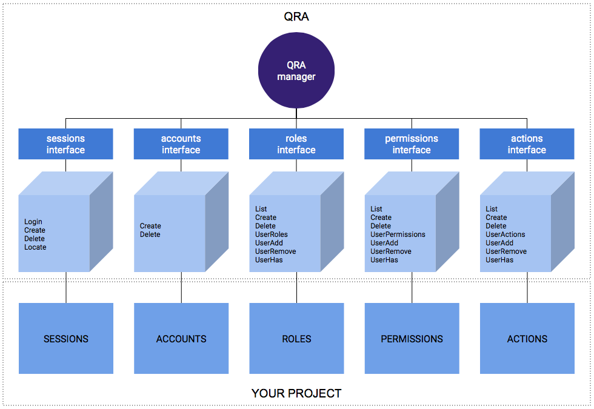

#### Quick and Robust Admin interfaces written in Go

[](http://opensource.org/licenses/MIT)
[](https://travis-ci.org/jimmy-go/qra)
[](https://goreportcard.com/report/github.com/jimmy-go/qra)
[](http://godoc.org/github.com/jimmy-go/qra)
[](https://coveralls.io/github/jimmy-go/qra?branch=master)

QRA is a collection of interfaces for common tasks building
authentication and authorization-designation policies.



##### Installation:
```
go get gopkg.in/jimmy-go/qra.v0
```

##### Description:
In order to understand QRA you must know:

**Identity** is a responsible party person or non-person entity.

**Authentication** is the means used to prove identity or take on
a role.

**Authorization** means access policy by explicitly granting a right.

QRA is not limited to administrator sites, you can gain
permission granularity for microservices too.

```
// Identity interface for management of identities (users).
type Identity interface {
	// Me method returns identity name (username, userID, etc.)
	Me() string

	// Session method returns current session or error.
	// If session is found then is written to dst.
	Session(dst interface{}) error
}

// Authentication interface for session management of users.
type Authentication interface {
	// Authenticate method makes login to user. It will call
	// Me method to retrieve Identity username, validate
	// if not session is present with Session method.
	// Developer implementations of Authentication interface
	// MUST have session storage methods.
	Authenticate(ctx Identity, password string, dst interface{}) error

	// Close method will delete session of current identity.
	Close(ctx Identity) error
}

// Designation interface stands for Authorization-Designation
// operations.
type Designation interface {
	// Search permission-designations and binds table designation content to v.
	// Return error if not permission for identity was found.
	// Filter parameter will allow search permissions by
	// name, resource and has pagination (e.g.: `permission:resource/1-36` or
	// `permission:resource/since/123abc`).
	Search(ctx Identity, v interface{}, filter string) error

	// Allow method shares identity permission over resource with dst.
	Allow(ctx Identity, password, permission, resource, dst string, expiresAt time.Time) error

	// Revoke method will revoke a permission that ctx previously
	// give to dst.
	Revoke(ctx Identity, password, permission, resource, dst string) error
}
```

##### Usage:

QRA needs a default manager that you must register at init time.
```
qra.MustRegisterAuthentication(yourAuthentication)
qra.MustRegisterDesignation(yourDesignationAuthorization)
```

Inside your project call some qra function.
```
func MyLoginHandler(w http.Response, r *http.Request) {

    username := r.Form.Get("username")
    ctx := &SomeContext{User: username} // must satisfy qra.Identity interface

    password := r.Form.Get("password")

    var token string
    err := qra.Authenticate(ctx, password, &token) error {
    // check errors...
}
```

##### One more thing...
QRA has a collection of managers with several database integrations:

`qra/litemanager.Connect("sqlite", "url://somedatabasefile.sql")` registers a manager
with sqlite integration.

`qra/pgmanager.Connect("postgres", "url://somedatabasefile.sql")` registers a manager
with PostgreSQL integration.

`qra/rawmanager.Connect()` is a manager with only cache data (never use it on production,
demonstration purposes only).

##### Examples:

See the [QRA examples](https://github.com/jimmy-go/qra-examples) for real world usage.

##### License:

MIT License

Copyright (c) 2016 Angel Del Castillo

Permission is hereby granted, free of charge, to any person obtaining a copy
of this software and associated documentation files (the "Software"), to deal
in the Software without restriction, including without limitation the rights
to use, copy, modify, merge, publish, distribute, sublicense, and/or sell
copies of the Software, and to permit persons to whom the Software is
furnished to do so, subject to the following conditions:

The above copyright notice and this permission notice shall be included in all
copies or substantial portions of the Software.

THE SOFTWARE IS PROVIDED "AS IS", WITHOUT WARRANTY OF ANY KIND, EXPRESS OR
IMPLIED, INCLUDING BUT NOT LIMITED TO THE WARRANTIES OF MERCHANTABILITY,
FITNESS FOR A PARTICULAR PURPOSE AND NONINFRINGEMENT. IN NO EVENT SHALL THE
AUTHORS OR COPYRIGHT HOLDERS BE LIABLE FOR ANY CLAIM, DAMAGES OR OTHER
LIABILITY, WHETHER IN AN ACTION OF CONTRACT, TORT OR OTHERWISE, ARISING FROM,
OUT OF OR IN CONNECTION WITH THE SOFTWARE OR THE USE OR OTHER DEALINGS IN THE
SOFTWARE.
